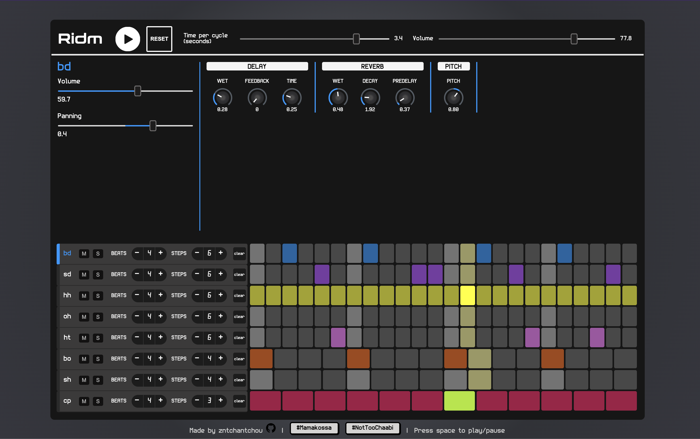
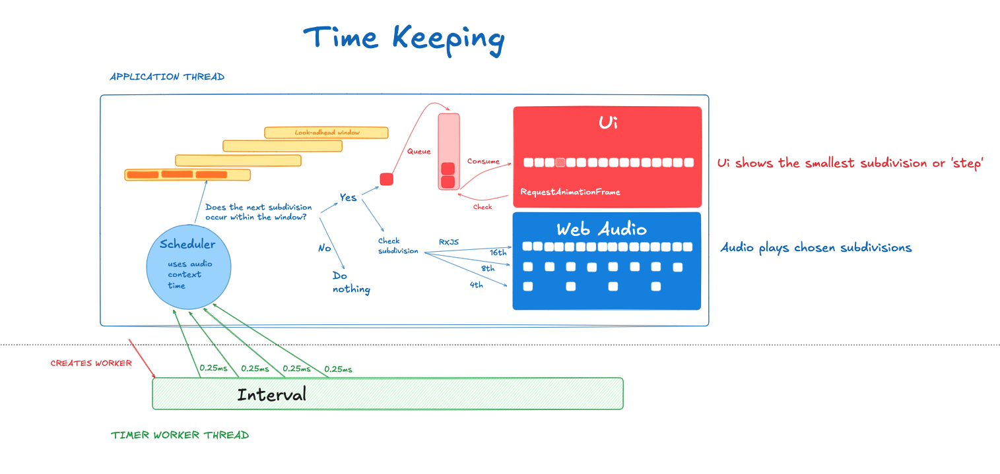

# Ridm

website: https://ridm.zacharie-ntc.dev/

**A polyrhythmic step sequencer that lets you layer drum patterns at different tempos—all perfectly in sync.**

Ridm is a web-based drum machine where each track can run at its own speed while staying locked to the master clock. Create complex, evolving beats by combining patterns with the desired meter (number of steps). Add reverb, delay, and pitch effects to each track. Two examples involving polyrythms are accessible below the sequencer.

The initial architecture is definitely inspired by this Chris Wilson article: https://web.dev/articles/audio-scheduling



## Features

- **Multi-tempo sequencing**: Run up to 8 independent drum tracks, each with different step counts
- **Real-time effects**: Per-track reverb, delay, and pitch shifting
- **Smart tempo management**: Efficient hierarchical pulse system keeps everything in sync
- **Persistent state**: Your sessions are automatically saved to browser storage
- **Channel controls**: Individual volume, pan, mute, and solo for each track

## Installation

### Prerequisites

- Node.js (v16 or higher)
- npm or yarn

### Setup

```bash
# Clone the repository
git clone git@github.com:zntchantchou/ridm.git
cd ridm

# Install dependencies
npm install

# Start the development server
npm run dev
```

The app will be available at `http://localhost:5173`

### Build for Production

```bash
# Build the application
npm run build

# Preview the production build
npm run preview
```

### Build with Docker

If you don't have Node.js installed, you can build the application using Docker and docker-compose:

```bash
# Build the Docker image (this runs npm install and npm run build)
docker compose up --build
```

The 'dist' folder will be created in your project root directory with the built application files.

## Architecture

### System Overview



### The Pulses System: Managing Multiple Tempos

The heart of Ridm is the **Pulses** system—a hierarchical architecture that manages multiple sequencer tempos. Instead of ticking each track independently (which would be computationally expensive and prone to drift), Pulses creates a top-down hierarchy where "lead" pulses drive related "child" pulses.

#### The Problem It Solves

When you have multiple step sequencers running at different speeds (e.g., 4 steps, 8 steps, 16 steps), you need them to stay perfectly synchronized. A naive approach would tick each sequencer on its own timer, but this leads to:

- Accumulated timing drift
- Redundant calculations
- Poor CPU efficiency
- Synchronization issues

The Pulses system solves this by recognizing mathematical relationships between step counts and creating a parent-child hierarchy.

#### Core Concepts

**Pulse Types:**

- **Lead Pulse**: Actively ticks and drives the timing, broadcasts to steppers and child pulses
- **Child Pulse**: Passive, derived from a parent lead pulse, doesn't tick independently

**Hierarchy Rule:**
A pulse with N steps can be a parent to a pulse with M steps if `N % M == 0` (N is divisible by M).

**Example:**

- A 16-step pulse can parent 8-step, 4-step, 2-step, and 1-step pulses
- An 8-step pulse can parent 4-step, 2-step, and 1-step pulses
- A 12-step pulse can parent 6-step, 4-step, 3-step, 2-step, and 1-step pulses

#### The Tick Cycle

```

Web Worker (25ms tick interval)
↓
Timerworker.tick(audioContextTime)
↓
Pulses.getLeadPulses() → only lead pulses retrieved
↓
Each lead pulse: pulse.discover(audioContextTime, window)
↓
Look ahead in audio buffer (~50ms window)
↓
For each step in window: pulse.pulsate(stepNumber, time)
↓
├─→ Emit to all listening steppers
└─→ Trigger child pulses proportionally
↓
StepQueue.push(step) + currentStepSubject.next()
↓
Stepper checks isSelectedStep()
↓
Track.playSample(scheduledTime) via Tone.js

```

#### Example Hierarchy

```

User creates three steppers:

- Stepper A: 4 beats × 4 stepsPerBeat = 16 steps
- Stepper B: 2 beats × 4 stepsPerBeat = 8 steps
- Stepper C: 4 beats × 4 stepsPerBeat = 16 steps

Resulting hierarchy:
┌─ Lead Pulse (16 steps) [Steppers A, C listen here]
│ └─ Child Pulse (8 steps) [Stepper B listens to 16-step lead]
└─ Only 1 lead pulse ticks actively
→ When it reaches step 8, the 8-step child is notified
→ When it reaches step 16, both complete a cycle

```

This architecture is the reason Ridm can handle complex polyrhythms without timing issues or CPU strain. Whether you're running 2 tracks or 8, the system intelligently minimizes the work needed to keep everything locked together.

## Technology Stack

- **TypeScript** - Type-safe application code
- **Vite** - Lightning-fast build tool and dev server
- **Tone.js** - Web Audio framework for sample playback and effects
- **RxJS** - Reactive state management with observables
- **Vitest** - Unit testing with jsdom
- **Web Workers** - Off-main-thread timing for precision

## Project Structure

```

src/
├── main.ts # Application entry point
├── modules/
│ ├── Pulses.ts # Pulse hierarchy manager (core architecture)
│ ├── Pulse.ts # Individual pulse timing logic
│ ├── Sequencer.ts # Coordinates steppers and tracks
│ ├── Audio.ts # Tone.js context and effects
│ ├── Track.ts # Audio sample + effect chain per stepper
│ ├── Timerworker.ts # Scheduling and lookahead logic
│ └── StepQueue.ts # Queue for scheduled steps
├── components/
│ ├── Stepper.ts # Step sequencer UI
│ ├── Controls.ts # Global tempo and volume controls
│ ├── SoundPanel.ts # Per-track effect controls
│ └── ... # Other UI components (Fader, Knob, Toggle, etc.)
├── state/
│ ├── State.ts # Global state manager with RxJS subjects
│ ├── Storage.ts # localStorage persistence
│ ├── state.templates.ts # Preset pattern templates
│ └── ... # Constants, types, and utilities
├── worker/
│ └── worker.ts # Web Worker for tick timing (25ms interval)
└── tests/ # Unit tests for Pulses and core logic

```

## Contributing

Contributions are welcome! Please feel free to submit issues or pull requests.

## Caveats

Updating the time per cycle restarts the loop so as to keep the steppers (tracks) synchronized.

## License

MIT

```

```
